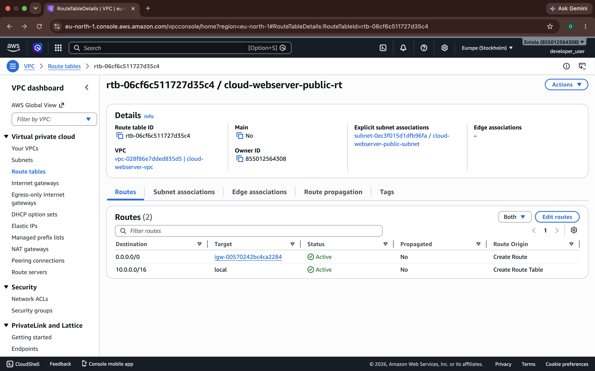
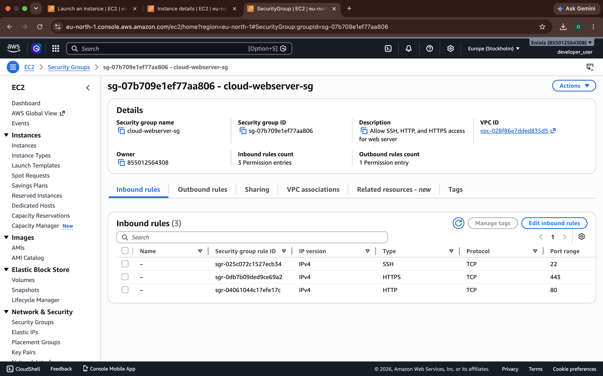
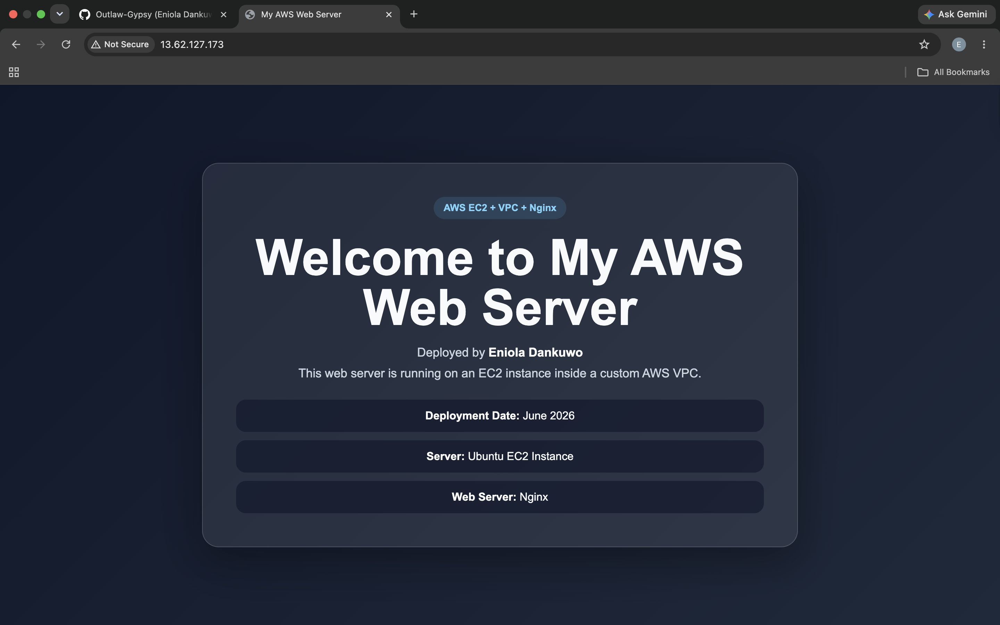

# AWS Web Server Deployment with VPC, EC2, Nginx and Security Best Practices

## Project Overview

This project demonstrates how to deploy a secure cloud-based web server on AWS using a custom VPC, public subnet, route table, Internet Gateway, EC2 instance, security group, SSH, Linux administration, and Nginx.

The goal of the project is to host a custom webpage on an EC2 instance while following basic AWS networking and security best practices.

## Project Scenario

I was tasked as a Junior Cloud Engineer to deploy a company's website on AWS. The web server needed to be accessible from the internet while being placed inside a properly configured AWS network environment.

## Project Objectives

The project demonstrates practical knowledge of:

- AWS VPC
- CIDR blocks and subnets
- Route tables
- Internet Gateway
- Security groups
- EC2
- SSH
- Linux administration
- Nginx
- Public IP addressing
- IAM
- Basic troubleshooting
- Cloud architecture documentation

## Architecture Diagram

The architecture includes the following components:

- Internet Users
- AWS Cloud
- Custom VPC
- Public Subnet
- Internet Gateway
- Route Table
- Security Group
- EC2 Instance
- Nginx Web Server


## Architecture Explanation

The infrastructure was designed inside an AWS Cloud environment. A custom VPC was created with the CIDR block `10.0.0.0/16`. Inside the VPC, a public subnet was planned using the CIDR block `10.0.1.0/24`.

An Internet Gateway allows internet connectivity for resources inside the VPC. A route table directs internet-bound traffic through the Internet Gateway. The EC2 instance is placed inside the public subnet and protected by a security group. The security group allows HTTP traffic from the internet and restricts SSH access to my own IP address.

Nginx is installed on the EC2 instance to serve a custom webpage.

---

## Stage 1: Project Understanding

Before creating AWS resources, I reviewed the project requirements and identified the main services needed for the deployment.

The required cloud components are:

- VPC
- Public subnet
- Internet Gateway
- Route table
- Security group
- EC2 instance
- Nginx web server

The expected final deliverables are:

- Architecture diagram
- Screenshots of AWS resources
- Public website URL or public IP address
- Project documentation
- Troubleshooting report
- Optional bash deployment script

---

## Stage 2: Architecture Design

I created an architecture diagram showing how users from the internet will access the web server hosted on AWS.

The diagram shows an internet user accessing the EC2 instance through the public IP address. The traffic enters the AWS environment through the Internet Gateway and reaches the EC2 instance in the public subnet. The security group controls which traffic is allowed to reach the instance.

### Screenshot


### What I Learned

I learned that a public EC2 web server requires more than just launching an instance. The network must include a VPC, a public subnet, an Internet Gateway, a route table with a public route, and a security group that allows the required traffic.

---

## Stage 3: Create a Custom VPC

### Purpose

The VPC acts as the private network boundary for the AWS resources in this project.

I created a custom VPC instead of using the default VPC because the project required me to demonstrate manual cloud networking setup.

### VPC Configuration

| Setting | Value |
|---|---|
| VPC Name | `cloud-webserver-vpc` |
| IPv4 CIDR Block | `10.0.0.0/16` |
| IPv6 CIDR Block | No IPv6 CIDR block |
| Tenancy | Default |

### Steps Taken

1. I logged in to the AWS Management Console.
2. I searched for `VPC` in the AWS search bar.
3. I opened the VPC dashboard.
4. I clicked `Your VPCs`.
5. I clicked `Create VPC`.
6. I selected `VPC only`.
7. I entered the name `cloud-webserver-vpc`.
8. I entered the IPv4 CIDR block `10.0.0.0/16`.
9. I left IPv6 disabled.
10. I kept tenancy as `Default`.
11. I clicked `Create VPC`.

### Screenshot


### Explanation

The custom VPC provides an isolated AWS network where the public subnet, route table, Internet Gateway, security group, and EC2 instance will be configured.

The CIDR block `10.0.0.0/16` gives the VPC enough private IP addresses for future subnet expansion.

### What I Learned

I learned that a VPC is the foundation of AWS networking. It does not automatically provide internet access. Internet access requires additional components such as an Internet Gateway and a route table.

---

## Stage 4: Create a Public Subnet

### Purpose

A subnet is a smaller network created inside a VPC. I created a public subnet to host the EC2 instance that will run the Nginx web server.

The subnet uses the CIDR block `10.0.1.0/24`, which is part of the larger VPC CIDR block `10.0.0.0/16`.

### Subnet Configuration

| Setting | Value |
|---|---|
| Subnet Name | `cloud-webserver-public-subnet` |
| VPC | `cloud-webserver-vpc` |
| VPC CIDR Block | `10.0.0.0/16` |
| Subnet CIDR Block | `10.0.1.0/24` |
| Availability Zone | `eu-north-1a` |

### Steps Taken

1. I opened the AWS Management Console.
2. I searched for `VPC` and opened the VPC dashboard.
3. I clicked `Subnets` from the left navigation menu.
4. I clicked `Create subnet`.
5. I selected my custom VPC named `cloud-webserver-vpc`.
6. I entered the subnet name `cloud-webserver-public-subnet`.
7. I selected an Availability Zone.
8. I entered the IPv4 subnet CIDR block `10.0.1.0/24`.
9. I clicked `Create subnet`.

### Screenshot


### Explanation

The public subnet is where the EC2 instance will be launched. At this point, the subnet has been created, but it is not fully public yet. For the subnet to become public, it must be associated with a route table that has a route to an Internet Gateway.

### What I Learned

I learned that a subnet is a smaller IP range inside a VPC. I also learned that a subnet is not automatically public just because it is named public. It becomes public only when its route table sends internet-bound traffic to an Internet Gateway.

---

## Stage 5: Create and Attach an Internet Gateway

### Purpose

An Internet Gateway allows communication between a VPC and the internet.

I created an Internet Gateway so that resources inside my VPC can later become publicly accessible when the correct route table configuration is added.

### Internet Gateway Configuration

| Setting | Value |
|---|---|
| Internet Gateway Name | `cloud-webserver-igw` |
| Attached VPC | `cloud-webserver-vpc` |
| VPC CIDR Block | `10.0.0.0/16` |
| State | `Attached` |

### Steps Taken

1. I opened the AWS Management Console.
2. I searched for `VPC` and opened the VPC dashboard.
3. From the left navigation menu, I clicked `Internet gateways`.
4. I clicked `Create internet gateway`.
5. I entered the name `cloud-webserver-igw`.
6. I clicked `Create internet gateway`.
7. After the Internet Gateway was created, I clicked `Actions`.
8. I selected `Attach to VPC`.
9. I selected my custom VPC named `cloud-webserver-vpc`.
10. I clicked `Attach internet gateway`.

### Screenshot


### Explanation

The Internet Gateway acts as the connection point between the VPC and the public internet.

At this stage, the gateway has been created and attached to the VPC, but the subnet is not fully public yet. A route table still needs to be configured with a default route that sends internet-bound traffic to the Internet Gateway.

### What I Learned

I learned that attaching an Internet Gateway to a VPC does not automatically make resources public. A route table must also contain a route such as `0.0.0.0/0` pointing to the Internet Gateway.

---

## Stage 6: Configure the Route Table and Subnet Association

### Purpose

A route table controls where network traffic is directed inside a VPC.

I created a custom route table for the public subnet and added a default route that sends internet-bound traffic to the Internet Gateway.

### Route Table Configuration

| Setting | Value |
|---|---|
| Route Table Name | `cloud-webserver-public-rt` |
| VPC | `cloud-webserver-vpc` |
| Public Subnet | `cloud-webserver-public-subnet` |
| Internet Gateway | `cloud-webserver-igw` |
| Public Route | `0.0.0.0/0 -> Internet Gateway` |

### Steps Taken

1. I opened the AWS Management Console.
2. I searched for `VPC` and opened the VPC dashboard.
3. From the left navigation menu, I clicked `Route tables`.
4. I clicked `Create route table`.
5. I entered the name `cloud-webserver-public-rt`.
6. I selected my custom VPC named `cloud-webserver-vpc`.
7. I clicked `Create route table`.
8. I selected the newly created route table.
9. I clicked the `Routes` tab.
10. I clicked `Edit routes`.
11. I clicked `Add route`.
12. I entered the destination `0.0.0.0/0`.
13. For the target, I selected the Internet Gateway named `cloud-webserver-igw`.
14. I clicked `Save changes`.
15. I clicked the `Subnet associations` tab.
16. I clicked `Edit subnet associations`.
17. I selected the public subnet named `cloud-webserver-public-subnet`.
18. I clicked `Save associations`.

### Screenshot



### Explanation

The route table contains a default route, `0.0.0.0/0`, that points to the Internet Gateway.

This route allows resources in the associated public subnet to send traffic to the internet. The subnet became public because it is associated with a route table that has a route to the Internet Gateway.

### What I Learned

I learned that a subnet is not public just because it has the word "public" in its name. A subnet becomes public when it is associated with a route table that has a default route to an Internet Gateway.

---

## Stage 7: Launch an EC2 Instance Inside the Public Subnet

### Purpose

The EC2 instance acts as the virtual server that will run the Nginx web server.

I launched the instance inside the public subnet so that it can be accessed from the internet through its public IPv4 address.

### EC2 Configuration

| Setting | Value |
|---|---|
| Instance Name | `cloud-webserver-ec2` |
| AMI | `Ubuntu Server` |
| Instance Type | `t3.micro` |
| VPC | `cloud-webserver-vpc` |
| Subnet | `cloud-webserver-public-subnet` |
| Auto-assign Public IP | `Enabled` |
| Key Pair | `cloud-webserver-key` |
| Security Group | `cloud-webserver-sg` |

### Steps Taken

1. I opened the AWS Management Console.
2. I searched for `EC2` and opened the EC2 dashboard.
3. I clicked `Instances`.
4. I clicked `Launch instances`.
5. I entered the instance name `cloud-webserver-ec2`.
6. I selected an Ubuntu Server AMI.
7. I selected a free-tier instance type `t3.micro`.
8. I created a key pair for SSH access.
9. Under network settings, I selected my custom VPC named `cloud-webserver-vpc`.
10. I selected the public subnet named `cloud-webserver-public-subnet`.
11. I enabled auto-assign public IP.
12. I created a security group named `cloud-webserver-sg`.
13. I reviewed the configuration and clicked `Launch instance`.
14. I waited until the instance state showed `Running`.
15. I confirmed that the instance had a public IPv4 address.

### Screenshot: EC2 Instance Running


### Explanation

The EC2 instance was launched inside the public subnet of the custom VPC. Because auto-assign public IP was enabled, AWS assigned a public IPv4 address to the instance.

This public IP address will be used to access the Nginx webpage from a browser after the web server is installed and configured.

### What I Learned

I learned that launching an EC2 instance requires selecting the correct VPC and subnet. I also learned that an instance in a public subnet must have a public IP address before it can be accessed directly from the internet.

---

## Stage 8: Configure and Review Security Group Rules

### Purpose

A security group acts as a virtual firewall for an EC2 instance. It controls which inbound and outbound traffic is allowed.

For this project, I configured the security group to allow web traffic while restricting SSH access to my own IP address.

### Security Group Configuration

| Type | Protocol | Port | Source | Purpose |
|---|---|---:|---|---|
| SSH | TCP | `22` | `My IP` | Allows secure terminal access to the EC2 instance |
| HTTP | TCP | `80` | `0.0.0.0/0` | Allows users on the internet to access the website |
| HTTPS | TCP | `443` | `0.0.0.0/0` | Allows secure web traffic if SSL/TLS is configured later |

### Steps Taken

1. I opened the AWS Management Console.
2. I searched for `EC2` and opened the EC2 dashboard.
3. I clicked `Security Groups` from the left navigation menu.
4. I selected the security group attached to my EC2 instance.
5. I reviewed the inbound rules.
6. I confirmed that SSH on port `22` was restricted to my own IP address.
7. I confirmed that HTTP on port `80` was open to users on the internet.
8. I confirmed that HTTPS on port `443` was added for secure web traffic readiness.
9. I avoided opening unnecessary ports.

### Screenshot: Security Group Rules



### Explanation

The security group protects the EC2 instance by controlling allowed inbound traffic.

SSH access is restricted to my own IP address to reduce the risk of unauthorized login attempts. HTTP is open to the internet because users need to access the hosted website through a browser. HTTPS is also included as a best-practice web port, even though SSL/TLS may be configured later.

### What I Learned

I learned that security groups are important for controlling access to cloud resources. Instead of opening all ports to everyone, I should allow only the ports required for the application to work.

### Security Best Practice Applied

The most important security decision in this stage was restricting SSH access.

Instead of allowing SSH from anywhere:

```text
0.0.0.0/0
```
I restricted SSH to:
```text
My IP
```
This follows the principle of least privilege because only my current IP address can attempt to connect to the instance through SSH.

---

## Stage 9: Connect to the EC2 Instance Using SSH

### Purpose

SSH, which stands for Secure Shell, allows secure remote access from my local computer into the EC2 instance.

In this stage, I used SSH to connect to the Ubuntu EC2 instance so I could manage the server from the terminal and later install Nginx.

---

### SSH Connection Requirements

To connect successfully to the EC2 instance, I needed the following:

| Requirement | Description |
|---|---|
| Private key file | The `.pem` key downloaded when creating the EC2 key pair |
| EC2 username | `ubuntu` because I used an Ubuntu Server AMI |
| Public IPv4 address | The current public IP address assigned to the EC2 instance |
| Security group rule | Inbound SSH access on port `22` allowed from my IP address |
| Correct file permission | The private key file must not be publicly readable |

---

### SSH Details

| Setting | Value |
|---|---|
| Key Pair | `cloud-webserver-key.pem` |
| Local Key Location | `Downloads` folder |
| EC2 Username | `ubuntu` |
| SSH Port | `22` |
| Authentication Method | SSH private key |
| SSH Source | My current public IP address |

---

### Steps Taken

1. I returned to the AWS Management Console.
2. I opened the EC2 dashboard.
3. I selected my EC2 instance.
4. I started the instance because it had been stopped earlier.
5. I waited until the instance state changed to `Running`.
6. I confirmed that the status checks passed.
7. I copied the current public IPv4 address from the EC2 instance details page.
8. I opened my terminal on my local machine.
9. I navigated to the folder where my private key was stored.
10. I attempted to connect to the EC2 instance using SSH.
11. The first SSH attempt failed with a timeout error.
12. I investigated the security group attached to the EC2 instance.
13. I discovered that the SSH inbound rule was not allowing access from my current public IP address.
14. I edited the security group inbound rules.
15. I updated the SSH rule to allow port `22` from `My IP`.
16. I saved the updated security group rule.
17. I retried the SSH connection.
18. The SSH connection succeeded.

---

### Command Used

Because my key was stored in the `Downloads` folder, I connected using:

```bash
ssh -i cloud-webserver-key.pem ubuntu@13.62.127.173
```
The general SSH command format is:
```bash
ssh -i path-to-key-file ubuntu@EC2_PUBLIC_IPV4
```

### Screenshot: SSH Connected


### Explanation

The SSH connection uses the private key file to authenticate into the EC2 instance. Since I used an Ubuntu AMI, the correct default username was ubuntu.
The EC2 instance also needed to have a public IPv4 address, and the security group had to allow inbound SSH traffic on port 22.
At first, the connection failed because my SSH traffic was not allowed by the security group. After updating the SSH source to my current IP address, the connection succeeded.

### Challenge Encountered: SSH Connection Timed Out
Problem

When I tried to connect to the EC2 instance using SSH, the connection timed out.

Error Message
```text
ssh: connect to host 13.62.127.173 port 22: Operation timed out
```
### What the Error Means

This error means my local machine could not reach the EC2 instance on port 22.

This was not a private key problem. If the private key was wrong, the error would likely have been:
```text
Permission denied (publickey)
```
Since the error was a timeout, it meant the SSH request was being blocked or could not reach the instance.

### Cause

The issue was caused by the security group inbound rule.

The SSH rule was not allowing access from my current public IP address.

This likely happened because I stopped the EC2 instance and continued the project later from a network whose public IP address was different from the one previously allowed in the security group.

The security group itself did not reset. Instead, the source IP allowed for SSH no longer matched my current public IP address.

### Solution

To fix the issue, I updated the security group inbound rule for SSH.

I followed these steps:

1. I opened the AWS Management Console.
2. I went to the EC2 dashboard.
3. I selected my running EC2 instance.
4. I clicked the Security tab.
5. I opened the security group attached to the instance.
6. I clicked Edit inbound rules.
7. I found the SSH rule for port 22.
8. I changed the source to My IP.
9. I saved the rule.
10. I retried the SSH command from my terminal.
11. The SSH connection worked successfully.

### Security Group Rule After Fix
| Type  | Protocol |  Port | Source      | Purpose                                                  |
| ----- | -------- | ----: | ----------- | -------------------------------------------------------- |
| SSH   | TCP      |  `22` | `My IP`     | Allows SSH access only from my current public IP address |
| HTTP  | TCP      |  `80` | `0.0.0.0/0` | Allows users to access the web server in a browser       |
| HTTPS | TCP      | `443` | `0.0.0.0/0` | Allows secure web traffic if SSL/TLS is configured later |

### Why This Fix Worked

Security groups act as virtual firewalls for EC2 instances.

Even though the EC2 instance was running and had a public IPv4 address, SSH access could not work until the security group allowed inbound traffic on port 22 from my current IP address.

After I updated the SSH source to My IP, AWS allowed my terminal to connect to the EC2 instance.

### What I Learned

I learned that SSH access depends on more than just the key pair and public IP address.

For SSH to work, the following must all be correct:

1. The EC2 instance must be running.
2. The public IPv4 address must be correct.
3. The correct username must be used.
4. The correct private key must be used.
5. The private key must have the correct permissions.
6. The security group must allow inbound SSH traffic on port 22.
7. The SSH source IP must match my current public IP address.

I also learned that stopping and starting an EC2 instance can change its public IPv4 address if no Elastic IP is attached. In addition, my local network public IP can change, which means a security group rule restricted to My IP may need to be updated.

---

## Stage 10: Install and Start Nginx

### Purpose

Nginx is the web server software used to serve the website from the EC2 instance.

After connecting to the instance through SSH, I installed Nginx, started the service, enabled it to run on boot, and tested the default Nginx page from a browser.

### Commands Used

```bash
sudo apt update -y
sudo apt install nginx -y
sudo systemctl start nginx
sudo systemctl enable nginx
sudo systemctl status nginx
```

### Steps Taken
1. I connected to the EC2 instance using SSH.
2. I updated the package list using sudo apt update -y.
3. I installed Nginx using sudo apt install nginx -y.
4. I started the Nginx service.
5. I enabled Nginx to start automatically when the instance boots.
6. I checked the Nginx service status.
7. I confirmed that Nginx showed active (running).
8. I copied the EC2 public IPv4 address.
9. I opened the public IPv4 address in my browser using HTTP.
10. I confirmed that the default Nginx welcome page loaded successfully.

### Screenshot: Nginx Running


### Screenshot: Nginx Default Page


### Explanation

Installing Nginx turned the EC2 instance into a web server. The browser was able to access the server because the instance was in a public subnet, had a public IPv4 address, and the security group allowed inbound HTTP traffic on port 80.

### What I Learned

I learned that launching an EC2 instance does not automatically make it a web server. A web server package such as Nginx must be installed and running before the instance can serve web content.

I also learned that browser access depends on both the Nginx service running and the security group allowing HTTP traffic on port 80.

---

## Stage 11: Replace the Default Nginx Page with a Custom Webpage

### Purpose

After confirming that Nginx was installed and running, I replaced the default Nginx welcome page with a custom HTML webpage.

This custom webpage proves that I can modify the default web content served by Nginx and host my own page from the EC2 instance.

### Web Directory

On Ubuntu, Nginx serves its default web files from:

```text
/var/www/html
```
The default Nginx page file is commonly:
```text
/var/www/html/index.nginx-debian.html
```
In this project, I edited the existing default Nginx HTML file and replaced its original content with my custom webpage HTML code.

Commands Used:
```bash
sudo vi /var/www/html/index.nginx-debian.html
cat /var/www/html/index.nginx-debian.html
sudo systemctl restart nginx
sudo systemctl status nginx
```

### Steps Taken
1. I connected to the EC2 instance using SSH.
2. I navigated to the default Nginx web directory at /var/www/html.
3. I opened the default Nginx HTML file named index.nginx-debian.html using Nano.
4. I removed the default Nginx welcome page content.
5. I pasted my custom HTML and CSS code into the file.
6. I included my name and deployment date on the page.
7. I saved the file and exited Nano.
8. I confirmed the file content from the terminal.
9. I restarted the Nginx service.
10. I checked that Nginx was still active and running.
11. I opened the EC2 public IPv4 address in my browser.
12. I confirmed that my custom webpage loaded successfully.

### Screenshot: Custom Webpage



### Explanation

Nginx serves files from /var/www/html by default on Ubuntu. The file index.nginx-debian.html is the default Nginx landing page file used on Ubuntu-based Nginx installations.

By editing this file and replacing its default content with my own HTML code, I changed what users see when they visit the EC2 instance public IPv4 address in a browser.

The webpage was accessible because the EC2 instance was running, Nginx was active, HTTP traffic was allowed on port 80, and the public subnet had a route to the Internet Gateway.

### What I Learned

I learned that Nginx serves website files from a web root directory, and the content displayed in the browser depends on the HTML files inside that directory.

I also learned that I can customize the default Nginx page either by editing the existing index.nginx-debian.html file or by creating a new index.html file in the same directory.

Editing the default file worked for this project because it directly replaced the page Nginx was already serving.

---

## Stage 12: Bash Deployment Script

### Purpose

As a bonus task, I created a Bash deployment script to automate the Nginx installation and web page deployment process.

The script updates the server, installs Nginx, starts the Nginx service, enables Nginx on boot, creates a custom webpage, restarts Nginx, and checks the service status.

### Script Name

```text
deploy-nginx-webserver.sh
```
### Script Tasks

The script performs the following actions:

1. Updates the package list.
2. Installs Nginx.
3. Starts the Nginx service.
4. Enables Nginx to start automatically on boot.
5. Writes a custom HTML page into the Nginx web directory.
6. Restarts Nginx.
7. Checks the Nginx service status.

### Script Content
```bash
#!/bin/bash

echo "Starting Nginx web server deployment..."

echo "Updating package list..."
sudo apt update -y

echo "Installing Nginx..."
sudo apt install nginx -y

echo "Creating custom web page..."
sudo tee /var/www/html/index.nginx-debian.html > /dev/null <<EOF
<!DOCTYPE html>
<html lang="en">
<head>
  <meta charset="UTF-8">
  <title>My AWS Web Server</title>
</head>
<body>
  <h1>Welcome to My AWS Web Server</h1>
  <p>Deployed by Your Name</p>
  <p>Deployment Date: June 2026</p>
  <p>This web server is running on an AWS EC2 instance using Nginx.</p>
</body>
</html>
EOF

echo "Testing Nginx configuration..."
sudo nginx -t

echo "Starting Nginx service..."
sudo systemctl start nginx

echo "Enabling Nginx to start on boot..."
sudo systemctl enable nginx

echo "Reloading Nginx..."
sudo systemctl reload nginx

echo "Checking Nginx status..."
sudo systemctl status nginx 

echo "Deployment completed successfully."
```
### How to Make the Script Executable
```bash
chmod +x deploy-nginx-webserver.sh
```
### How to Run the Script
```bash
./deploy-nginx-webserver.sh
```

### Explanation

The script automates the manual steps used to install and configure Nginx. This is useful because automation reduces repetition, improves consistency, and makes server setup easier to reproduce.

### What I Learned

I learned that Bash scripts can be used to automate server configuration tasks. Instead of manually typing each command, I can place the commands in a script and run them as one repeatable deployment process.

---

## Skills Demonstrated

This project demonstrates hands-on experience with:

- AWS VPC networking
- CIDR block planning
- Public subnet creation
- Internet Gateway configuration
- Route table configuration
- Subnet-route table association
- EC2 instance deployment
- Public IPv4 addressing
- Security group configuration
- SSH access management
- Linux server administration
- Nginx installation and configuration
- Static web page deployment
- Bash scripting and deployment automation
- Cloud troubleshooting
- Technical documentation

---

## Repository Structure

```text
aws-secure-webserver-vpc-ec2-nginx/
│
├── README.md
├── deploy-nginx-webserver.sh
├── architecture-diagram.pdf
└── screenshots/
    ├── 01-architecture-diagram.png
    ├── 02-vpc-created.png
    ├── 03-public-subnet-created.png
    ├── 04-internet-gateway-attached.png
    ├── 05-route-table-configured.png
    ├── 06-ec2-instance-running.png
    ├── 07-security-group-rules.png
    ├── 08-ssh-connected.png
    ├── 09-nginx-service-running.png
    ├── 10-nginx-default-page.png
    ├── 11-custom-webpage-terminal.png
    └── 12-custom-webpage-browser.png
```


