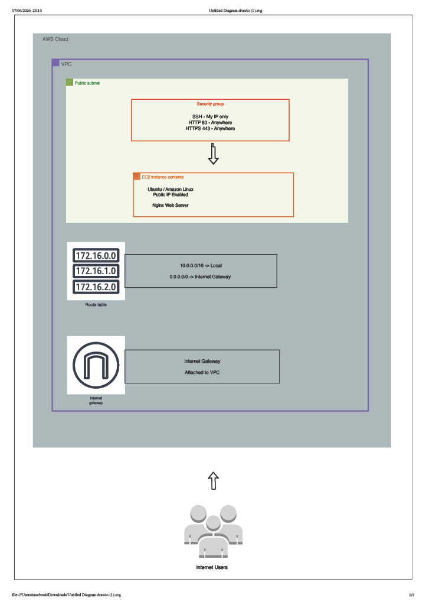
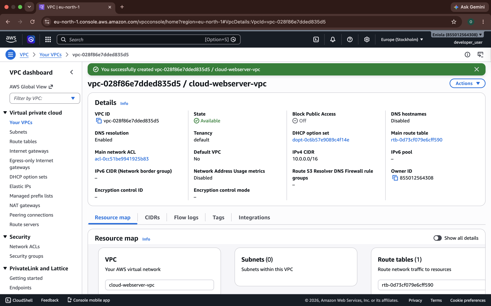
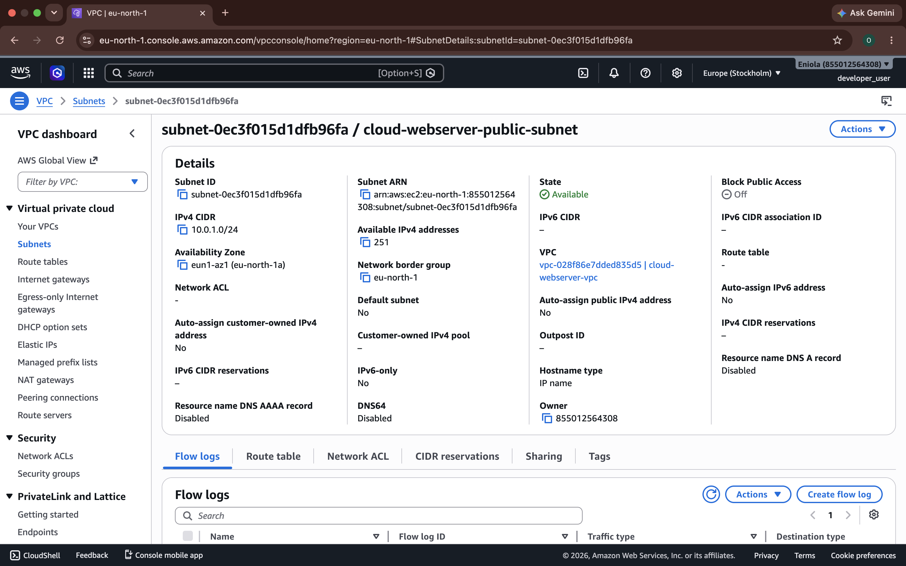
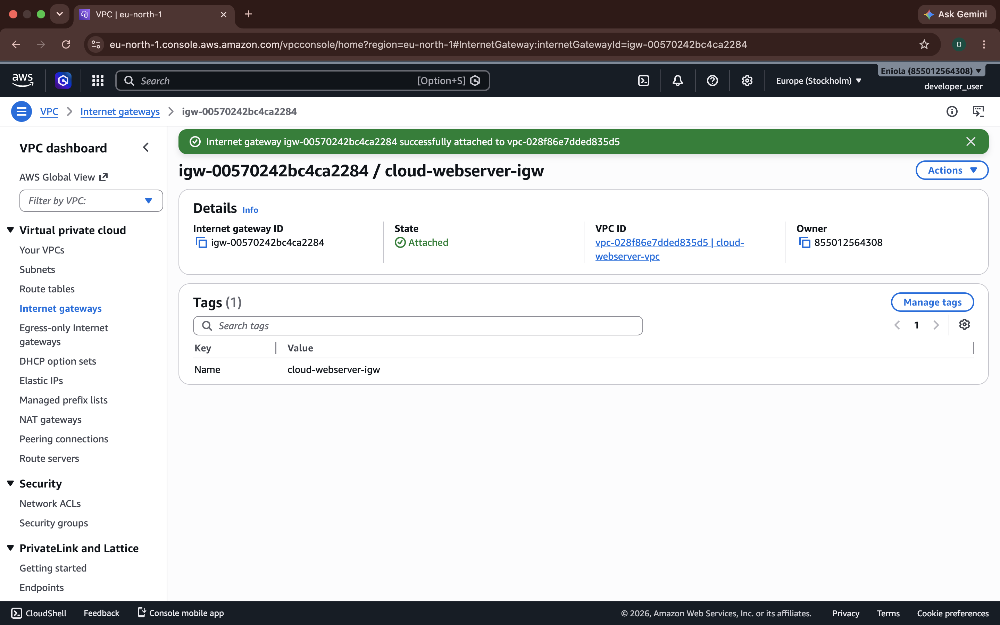
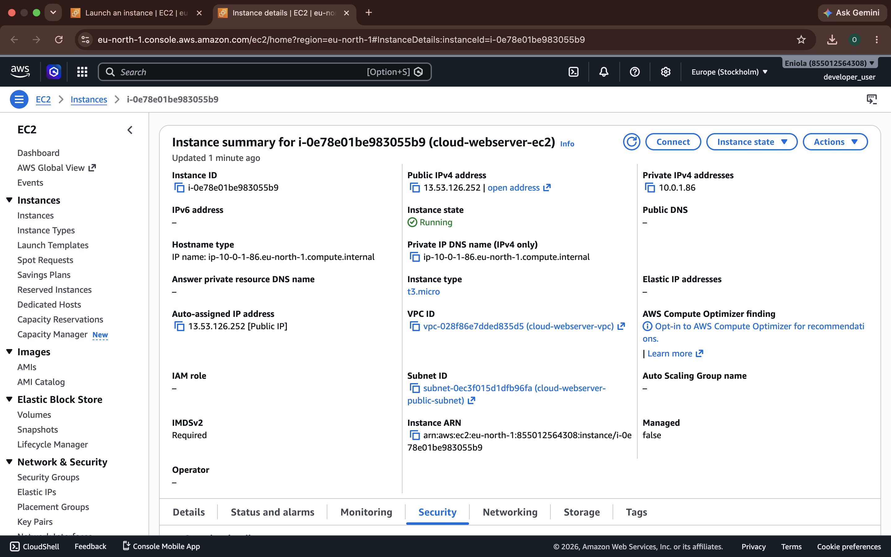
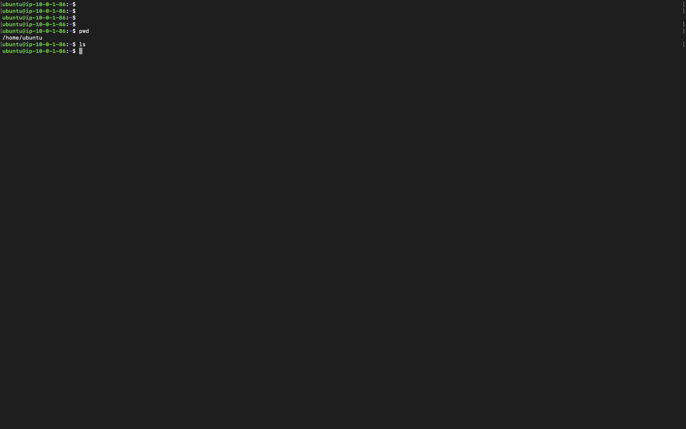
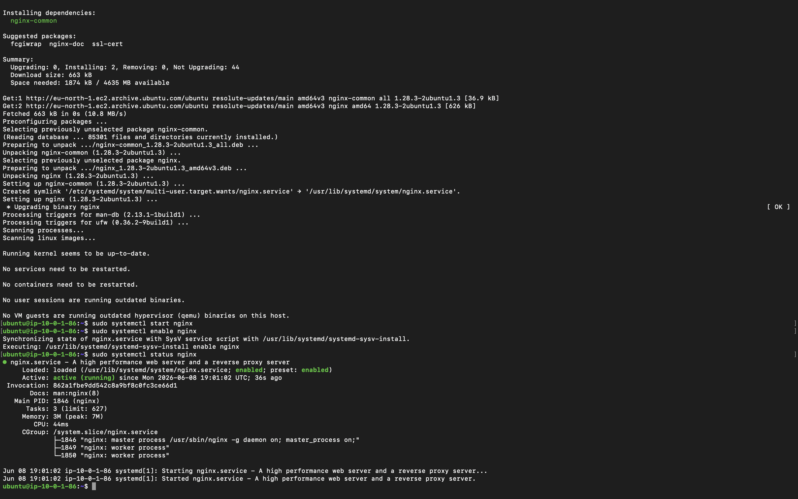
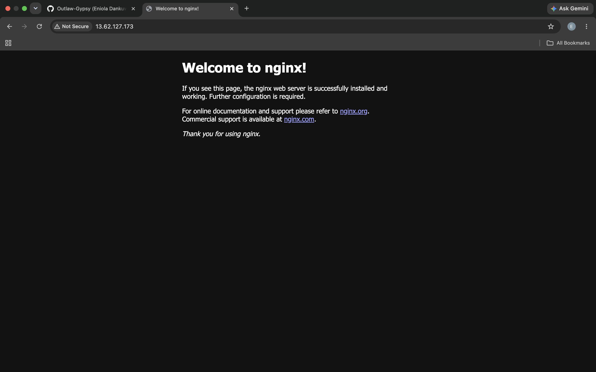

# AWS Secure Web Server Deployment Project Report

## Project Title

**AWS Web Server Deployment with VPC, EC2, Nginx, and Security Best Practices**

---

## Student Name

**Eniola Dankuwo**

---

## Project Date

**Deployment Date:** June 2026

---

## 1. Introduction

This project demonstrates the deployment of a secure cloud-based web server on Amazon Web Services using a custom VPC, public subnet, Internet Gateway, route table, EC2 instance, security group, SSH, Linux administration, and Nginx.

The goal of the project was to deploy a web server that is accessible from the internet while following basic AWS networking and security best practices.

The project helped me understand how different AWS networking components work together to allow a web server to run securely in the cloud.

---

## 2. Project Scenario

In this project, I acted as a Junior Cloud Engineer hired to deploy a company website on AWS.

The website needed to be hosted on an EC2 instance and made accessible to internet users. To achieve this, I designed and configured a cloud network using a custom VPC, public subnet, Internet Gateway, route table, and security group.

After the network was prepared, I launched an Ubuntu EC2 instance, connected to it using SSH, installed Nginx, and replaced the default Nginx page with a custom webpage.

---

## 3. Project Objectives

The main objectives of this project were to demonstrate practical knowledge of:

* AWS VPC
* CIDR blocks
* Public subnets
* Route tables
* Internet Gateway
* Security groups
* EC2 instances
* SSH access
* Linux server administration
* Nginx web server deployment
* Public IP addressing
* Basic cloud security
* Bash scripting
* Cloud architecture documentation

---

## 4. Architecture Diagram

The architecture includes the following components:

* Internet users
* AWS Cloud
* Custom VPC
* Public subnet
* Internet Gateway
* Route table
* Security group
* EC2 instance
* Nginx web server

### Architecture Diagram Screenshot

Insert your architecture diagram below:



---

## 5. Architecture Explanation

The architecture was designed inside AWS Cloud.

A custom VPC was created with the CIDR block `10.0.0.0/16`. Inside the VPC, a public subnet was created with the CIDR block `10.0.1.0/24`.

An Internet Gateway was attached to the VPC to allow internet connectivity. A custom route table was created and configured with a default route, `0.0.0.0/0`, pointing to the Internet Gateway.

The EC2 instance was launched inside the public subnet with public IPv4 addressing enabled. A security group was attached to the instance to control inbound traffic.

The security group allowed:

* SSH on port `22` from my IP address only
* HTTP on port `80` from the internet
* HTTPS on port `443` from the internet

Nginx was installed on the EC2 instance to serve a custom webpage.

---

## 6. AWS Resources Created

The following AWS resources were created during the project:

| Resource                 | Name / Configuration            |
| ------------------------ | ------------------------------- |
| VPC                      | `cloud-webserver-vpc`           |
| VPC CIDR Block           | `10.0.0.0/16`                   |
| Public Subnet            | `cloud-webserver-public-subnet` |
| Public Subnet CIDR Block | `10.0.1.0/24`                   |
| Internet Gateway         | `cloud-webserver-igw`           |
| Route Table              | `cloud-webserver-public-rt`     |
| EC2 Instance             | `cloud-webserver-ec2`           |
| Security Group           | `cloud-webserver-sg`            |
| Web Server               | Nginx                           |
| Operating System         | Ubuntu Server                   |

---

## 7. Deployment Steps

## Step 1: Create a Custom VPC

### Purpose

The VPC acts as the private network boundary for all AWS resources used in this project.

I created a custom VPC instead of using the default VPC because the project required manual configuration of AWS networking components.

### Configuration

| Setting         | Value                 |
| --------------- | --------------------- |
| VPC Name        | `cloud-webserver-vpc` |
| IPv4 CIDR Block | `10.0.0.0/16`         |
| IPv6 CIDR Block | No IPv6 CIDR block    |
| Tenancy         | Default               |

### Steps Taken

1. I opened the AWS Management Console.
2. I searched for `VPC`.
3. I opened the VPC dashboard.
4. I clicked `Your VPCs`.
5. I clicked `Create VPC`.
6. I selected `VPC only`.
7. I entered the name `cloud-webserver-vpc`.
8. I entered the IPv4 CIDR block `10.0.0.0/16`.
9. I left IPv6 disabled.
10. I kept tenancy as `Default`.
11. I clicked `Create VPC`.

### Screenshot



### Explanation

The VPC provides an isolated AWS network where the subnet, route table, Internet Gateway, security group, and EC2 instance were configured.

---

## Step 2: Create a Public Subnet

### Purpose

The public subnet was created to host the EC2 instance that runs the Nginx web server.

### Configuration

| Setting           | Value                           |
| ----------------- | ------------------------------- |
| Subnet Name       | `cloud-webserver-public-subnet` |
| VPC               | `cloud-webserver-vpc`           |
| VPC CIDR Block    | `10.0.0.0/16`                   |
| Subnet CIDR Block | `10.0.1.0/24`                   |
| Availability Zone | Your selected Availability Zone |

### Steps Taken

1. I opened the VPC dashboard.
2. I clicked `Subnets`.
3. I clicked `Create subnet`.
4. I selected my custom VPC named `cloud-webserver-vpc`.
5. I entered the subnet name `cloud-webserver-public-subnet`.
6. I selected an Availability Zone.
7. I entered the IPv4 subnet CIDR block `10.0.1.0/24`.
8. I clicked `Create subnet`.

### Screenshot



### Explanation

The subnet was created inside the custom VPC. At this stage, the subnet existed, but it was not fully public until it was associated with a route table that had a route to the Internet Gateway.

---

## Step 3: Create and Attach an Internet Gateway

### Purpose

The Internet Gateway allows communication between the VPC and the internet.

### Configuration

| Setting               | Value                 |
| --------------------- | --------------------- |
| Internet Gateway Name | `cloud-webserver-igw` |
| Attached VPC          | `cloud-webserver-vpc` |
| State                 | Attached              |

### Steps Taken

1. I opened the VPC dashboard.
2. I clicked `Internet gateways`.
3. I clicked `Create internet gateway`.
4. I entered the name `cloud-webserver-igw`.
5. I clicked `Create internet gateway`.
6. After the Internet Gateway was created, I clicked `Actions`.
7. I selected `Attach to VPC`.
8. I selected my custom VPC named `cloud-webserver-vpc`.
9. I clicked `Attach internet gateway`.

### Screenshot



### Explanation

The Internet Gateway created a path between the VPC and the public internet. However, internet access still required a route table configuration.

---

## Step 4: Configure the Route Table

### Purpose

The route table controls where network traffic is directed.

For the public subnet to access the internet, I configured a route table with a default route pointing to the Internet Gateway.

### Configuration

| Setting           | Value                           |
| ----------------- | ------------------------------- |
| Route Table Name  | `cloud-webserver-public-rt`     |
| VPC               | `cloud-webserver-vpc`           |
| Public Route      | `0.0.0.0/0 -> Internet Gateway` |
| Associated Subnet | `cloud-webserver-public-subnet` |

### Steps Taken

1. I opened the VPC dashboard.
2. I clicked `Route tables`.
3. I clicked `Create route table`.
4. I entered the name `cloud-webserver-public-rt`.
5. I selected my custom VPC named `cloud-webserver-vpc`.
6. I clicked `Create route table`.
7. I selected the new route table.
8. I clicked the `Routes` tab.
9. I clicked `Edit routes`.
10. I clicked `Add route`.
11. I entered the destination `0.0.0.0/0`.
12. I selected the Internet Gateway as the target.
13. I selected `cloud-webserver-igw`.
14. I clicked `Save changes`.
15. I clicked the `Subnet associations` tab.
16. I clicked `Edit subnet associations`.
17. I selected `cloud-webserver-public-subnet`.
18. I clicked `Save associations`.

### Screenshot


### Explanation

The public subnet became internet-accessible because it was associated with a route table that sends internet-bound traffic to the Internet Gateway.

---

## Step 5: Launch the EC2 Instance

### Purpose

The EC2 instance acts as the virtual server that hosts the Nginx web server.

### Configuration

| Setting               | Value                           |
| --------------------- | ------------------------------- |
| Instance Name         | `cloud-webserver-ec2`           |
| AMI                   | Ubuntu Server                   |
| Instance Type         | `t2.micro` or `t3.micro`        |
| VPC                   | `cloud-webserver-vpc`           |
| Subnet                | `cloud-webserver-public-subnet` |
| Auto-assign Public IP | Enabled                         |
| Security Group        | `cloud-webserver-sg`            |
| Key Pair              | `cloud-webserver-key.pem`       |

### Steps Taken

1. I opened the EC2 dashboard.
2. I clicked `Instances`.
3. I clicked `Launch instances`.
4. I entered the instance name `cloud-webserver-ec2`.
5. I selected an Ubuntu Server AMI.
6. I selected a free-tier instance type such as `t2.micro` or `t3.micro`.
7. I created or selected a key pair for SSH access.
8. Under network settings, I selected my custom VPC.
9. I selected the public subnet.
10. I enabled auto-assign public IP.
11. I created or selected the security group.
12. I launched the instance.
13. I waited until the instance state showed `Running`.

### Screenshot



### Explanation

The EC2 instance was launched inside the public subnet. Because public IPv4 addressing was enabled, the instance could be accessed from the internet once the correct security group rules were applied.

---

## Step 6: Configure Security Group Rules

### Purpose

The security group acts as a virtual firewall for the EC2 instance. It controls inbound and outbound traffic.

### Inbound Rules

| Type  | Protocol |  Port | Source      | Purpose                                 |
| ----- | -------- | ----: | ----------- | --------------------------------------- |
| SSH   | TCP      |  `22` | My IP       | Allows secure terminal access           |
| HTTP  | TCP      |  `80` | `0.0.0.0/0` | Allows website access from the internet |
| HTTPS | TCP      | `443` | `0.0.0.0/0` | Allows secure web traffic readiness     |

### Steps Taken

1. I opened the EC2 dashboard.
2. I clicked `Security Groups`.
3. I selected the security group attached to my EC2 instance.
4. I reviewed the inbound rules.
5. I ensured SSH was restricted to my IP address.
6. I ensured HTTP was open to the internet.
7. I included HTTPS for secure web traffic readiness.
8. I avoided opening unnecessary ports.

### Screenshot


### Explanation

The security group was configured using the principle of least privilege. SSH was restricted to my IP address only, while HTTP was opened to allow users to access the webpage.

---

## Step 7: Connect to the EC2 Instance Using SSH

### Purpose

SSH allows secure remote access to the EC2 instance from my local machine.

### SSH Details

| Setting               | Value                     |
| --------------------- | ------------------------- |
| Private Key           | `cloud-webserver-key.pem` |
| EC2 Username          | `ubuntu`                  |
| Port                  | `22`                      |
| Authentication Method | Private key               |
| Source                | My IP address             |

### Command Used

```bash
ssh -i cloud-webserver-key.pem ubuntu@13.62.127.173
```

### Steps Taken

1. I opened my local terminal.
2. I navigated to the folder where my private key was stored.
3. I confirmed the EC2 instance was running.
4. I copied the current public IPv4 address.
5. I connected to the instance using SSH.
6. I successfully accessed the Ubuntu terminal on the EC2 instance.

### Screenshot



### Explanation

The SSH connection worked after the EC2 instance was running, the correct public IP was used, the correct key pair was provided, and the security group allowed SSH from my IP address.

---

## Step 8: Install and Start Nginx

### Purpose

Nginx was installed to serve the website from the EC2 instance.

### Commands Used

```bash
sudo apt update -y
sudo apt install nginx -y
sudo systemctl start nginx
sudo systemctl enable nginx
sudo systemctl status nginx
```

### Steps Taken

1. I connected to the EC2 instance through SSH.
2. I updated the package list.
3. I installed Nginx.
4. I started the Nginx service.
5. I enabled Nginx to start automatically on boot.
6. I checked the Nginx service status.
7. I confirmed that Nginx was active and running.
8. I opened the EC2 public IP address in a browser.
9. I confirmed that the default Nginx page loaded.

### Screenshot: Nginx Service Running



### Screenshot: Nginx Default Page



### Explanation

Installing Nginx turned the EC2 instance into a web server. The page was accessible because Nginx was running, the EC2 instance had a public IP address, and HTTP traffic was allowed through the security group.

---

## Step 9: Replace the Default Nginx Page

### Purpose

The default Nginx welcome page was replaced with a custom webpage containing my name and deployment date.

### File Edited

```text
/var/www/html/index.nginx-debian.html
```

### Commands Used

```bash
sudo nano /var/www/html/index.nginx-debian.html
cat /var/www/html/index.nginx-debian.html
sudo systemctl restart nginx
sudo systemctl status nginx
```

### Steps Taken

1. I connected to the EC2 instance using SSH.
2. I opened the default Nginx HTML file using Nano.
3. I removed the default Nginx content.
4. I pasted my custom HTML and CSS code.
5. I included my name and deployment date.
6. I saved the file.
7. I restarted Nginx.
8. I checked that Nginx was still running.
9. I opened the EC2 public IPv4 address in my browser.
10. I confirmed that my custom webpage loaded successfully.


### Screenshot: Custom Webpage in Browser


### Explanation

Nginx serves web files from `/var/www/html` by default on Ubuntu. By editing `index.nginx-debian.html`, I replaced the default page with my custom webpage.

---

## 8. Bash Deployment Script

### Purpose

As a bonus task, I created a Bash script to automate the Nginx deployment process.

### Script Name

```text
deploy-nginx-webserver.sh
```

### Script Tasks

The script performs the following:

1. Updates the package list
2. Installs Nginx
3. Creates a custom webpage
4. Tests the Nginx configuration
5. Starts the Nginx service
6. Enables Nginx on boot
7. Reloads Nginx
8. Checks Nginx status

### Script Content

```bash
#!/bin/bash

echo "Starting Nginx web server deployment..."

echo "Updating package list..."
sudo apt update -y

echo "Installing Nginx..."
sudo apt install nginx -y

echo "Creating custom web page..."
sudo tee /var/www/html/index.nginx-debian.html > /dev/null <<EOF
<!DOCTYPE html>
<html lang="en">
<head>
  <meta charset="UTF-8">
  <title>My AWS Web Server</title>
</head>
<body>
  <h1>Welcome to My AWS Web Server</h1>
  <p>Deployed by Your Name</p>
  <p>Deployment Date: Your Deployment Date</p>
  <p>This web server is running on an AWS EC2 instance using Nginx.</p>
</body>
</html>
EOF

echo "Testing Nginx configuration..."
sudo nginx -t

echo "Starting Nginx service..."
sudo systemctl start nginx

echo "Enabling Nginx to start on boot..."
sudo systemctl enable nginx

echo "Reloading Nginx..."
sudo systemctl reload nginx

echo "Checking Nginx status..."
sudo systemctl status nginx --no-pager

echo "Deployment completed successfully."
```

### How to Make the Script Executable

```bash
chmod +x deploy-nginx-webserver.sh
```

### How to Run the Script

```bash
./deploy-nginx-webserver.sh
```

### Explanation

The Bash script automates the manual steps used to install and configure Nginx. This demonstrates a basic DevOps automation practice because the setup can be repeated consistently.

---

## 9. Final Website Test

After configuring Nginx and replacing the default page, I tested the website from a browser using the EC2 public IPv4 address.

### Public Website URL

```text
http://13.62.127.173
```

### Final Browser Screenshot


### Result

The custom webpage loaded successfully from the browser, confirming that:

* The EC2 instance was running
* Nginx was installed and active
* The public subnet routing was working
* The Internet Gateway was attached
* The route table had the correct public route
* The security group allowed HTTP traffic
* The custom webpage was correctly deployed

---

## 10. Security Measures Applied

The following security measures were applied during the project:

### SSH Restriction

SSH access was restricted to my IP address only.

This prevents the EC2 instance from accepting SSH login attempts from the entire internet.

### Limited Inbound Ports

Only required inbound ports were allowed:

* Port `22` for SSH
* Port `80` for HTTP
* Port `443` for HTTPS readiness

Unnecessary ports were not opened.

### Custom VPC

A custom VPC was used instead of relying on the default VPC. This allowed full control over the network design.

### Public Subnet Control

The EC2 instance was placed in a public subnet because it needed to serve a public website.

### Security Group Usage

The security group acted as the instance-level firewall for controlling inbound access.

---

## 11. Lessons Learned

Through this project, I learned that deploying a public web server on AWS requires several components working together.

I learned that a VPC is the network foundation, while subnets divide the VPC into smaller network segments. I also learned that a subnet is not public by name alone. It becomes public when associated with a route table that sends internet-bound traffic to an Internet Gateway.

I gained practical experience launching an EC2 instance inside a custom subnet, assigning a public IP address, configuring security group rules, and connecting to the instance using SSH.

I also learned how to install and manage Nginx on a Linux server and how to replace the default Nginx page with a custom webpage.

Finally, I learned how Bash scripting can automate deployment steps and reduce repetitive manual work.

---

## 12. Skills Demonstrated

This project demonstrates hands-on experience with:

* AWS VPC networking
* CIDR block planning
* Public subnet creation
* Internet Gateway configuration
* Route table configuration
* EC2 instance deployment
* Security group configuration
* SSH access management
* Linux server administration
* Nginx installation and configuration
* Static webpage deployment
* Bash scripting
* Cloud documentation
* Basic security best practices

---

## 13. Conclusion

This project successfully deployed a secure cloud-based web server on AWS.

I created a custom VPC, configured a public subnet, attached an Internet Gateway, set up a route table, launched an EC2 instance, configured security group rules, connected through SSH, installed Nginx, and deployed a custom webpage.

The final website was accessible from the internet through the EC2 public IPv4 address.

This project strengthened my understanding of AWS networking, EC2 deployment, Linux administration, Nginx configuration, and basic DevOps automation.

---

## 14. Repository Structure

```text
aws-secure-webserver-vpc-ec2-nginx/
│
├── README.md
├── deploy-nginx-webserver.sh
├── architecture-diagram.pdf
├── reports/
│   └── AWS-Secure-Webserver-Project-Report.pdf
└── screenshots/
    ├── 01-architecture-diagram.png
    ├── 02-vpc-created.png
    ├── 03-public-subnet-created.png
    ├── 04-internet-gateway-attached.png
    ├── 05-route-table-configured.png
    ├── 06-ec2-instance-running.png
    ├── 07-security-group-rules.png
    ├── 08-ssh-connected.png
    ├── 09-nginx-service-running.png
    ├── 10-nginx-default-page.png
    ├── 11-custom-webpage-terminal.png
    └── 12-custom-webpage-browser.png
```

---

## 15. Author

**Eniola Dankuwo**
Cloud/DevOps Engineering Track

**GitHub:** `https://github.com/Outlaw-Gypsy`
**LinkedIn:** `https://www.linkedin.com/in/dankuwo-eniola-124a4a19a/`
**Email:** `enioladankuwo@gmail.com`

